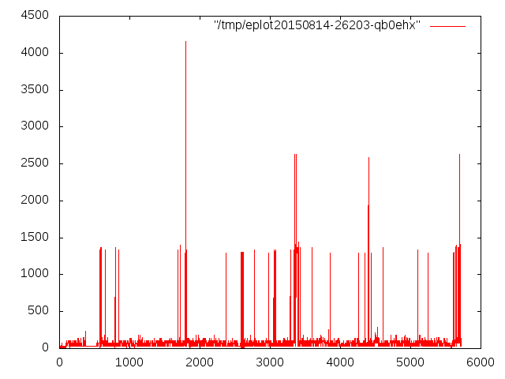

# read this first

http://csswizardry.com/2014/10/the-specificity-graph/

then listen this to this

https://www.youtube.com/watch?v=1OKZOV-iLj4

---

I'd try to write a paragraph here, but [Harry Roberts](http://csswizardry.com/) is really the best source of information on the topic of CSS architecture.

Apparently most people's CSS looks like this:

Y-axis: specificity 
X-axis: location in CSS file (or the order in which selectors are fed to the parser)

^ Erratic, specificity peaks and valleys, never-ending nightmare of overriding styles

When ideal CSS looks more like this:

^ Gradually increasing specificity, logical smooth sailing.

Specificity vs. position in ruleset is not the *only* thing that matters in creating a managable CSS architecture, but it's something you can quantitatively measure and control, unlike, say, modularity or extensibility.

Or creativity.

### Author's Note

~~I never bothered to look up how specificity is actually calculated and it turns out it's not completely trivial (unless you just happen to add it to a CSS parser... maybe there's something for postcss already and I just wasted my time...shit.)~~

There are a few tools available to do this for you already that are well-tested and that you can use with your favorite build tools out of the box just add water plug and play vanilla bean ice cream.

I made this for personal use and curiousity but more for **understanding** what specificity really means. I gave into div-classitis a while ago and have been content with that for everything, but through understanding one might find a better way.

# prereq
 - php
 - ruby
 - gnuplot

# run it

`php -f specificity.php some.css | ./eplot 2>/dev/null`

        See graphs pictured above.

# or if you want a PNG named "foo.png"

`php -f specificity.php github.css | ./eplot --png`

*Note: github's actual css as of Fri 14 Aug 2015 03:56:50 PM EDT*

*Note: graph may be wrong. *

# or just save the data points

And feed them to `gnuplot` yourself with all your favorite parameters and the 3D views and the pepper brush.

`php -f specificity.php graphsgraphsgraphs.com.css > datapoints.dat`

`gnuplot`

`gnuplot> plot 'datapoints.dat'`

# or if you're a hipster nerd

`php -f specificity.php some.css --output-json`

        [
            {
                "selector": "div.something-like-this:not(.idk):hover::before ~ input[type='tel'].blondie",
                
                "specificity": {
                    "base36": "053",   // how its actually calculated in this script
                                       //   !! actual browser results may vary !!
                                            
                    "base10": "183",   // number between 0 (for *) and 46656
                                       // !! this number does *not* matter unless 
                                       //    you want a visual *representation* !!
                                             
                    "tuple": [0,0,5,3] // human-understandable, most accurate, use this.
                                       // !! first digit is for the style=""
                                       //    html attribute, you know the one
                                       //    which you're never supposed to use !!
                                             
                                       //̂ ͤ͋ͯ̃!ͣ̌! ̋͑ͥt̂͛h̽̐iͤ̀s͗͒̐͊ͦ do̓ͦe̊sͯ͂̔ ͣ͐̔̄not͐̉ͦͮ ͣͣ͗̂ͯp̈ͮ͆̓a͂̉͛ͦ̏͌̚rsͨ͂́ͯe̋ͣ̐ͪͧ̊̎ ̓ͪhͤ̇̓tͤm̔ͨl̋ͦ̄ͬ ̋w͐ͨ̇̈́iͬͭ́̓̈t͛͂̔ͬ͒̀h r̂ͪͦ̔̐e͒͆̑̑͌géͫ̅̚x̍͗̃ !͒̄̃̒!̾ͯ̇̿ͯͬ
                },
                "position": "1",     // position in ruleset, starting from 1
                                     // inb4 muh zero-indexing
                                     
                					 // whitespace agnostic, comma-separated values 
                                     // are given the same numerical position.
                                     
                                     // position will effect styling (bigger number)
                                     // if specificity is the same 
                                     
                                     // also, selectors which directly target elements
                                     // beat out inheritance
                                      
                "important": 0       // JSON-only. According to MDN !important does
                                     // not have to do with specificity, since 
                                     // that is calculated only by selectors and 
                                     // inline-styles
                                     
                                     // but !important does effect individual rules
                                     // so this is a count for how many are found
                                     // within a ruleset for this selector
                                     
                                     // you may have to do additional addition to
                                     // really figure out what the browser will 
                                     // (probably, hopefully?) do
            }//, ...
        ]

# disclaimer

I haven't tested it thoroughly yet so use at your own risk or something

# credits

http://csswizardry.com/2014/10/the-specificity-graph/

http://www.w3.org/TR/css3-selectors/#specificity

---

http://stackoverflow.com/a/12868778

http://liris.cnrs.fr/christian.wolf/software/eplot/index.html

---

http://realworldvalidator.com/css/pseudoelements

https://gist.github.com/afabbro/3759334#gistcomment-716299

https://developer.mozilla.org/en-US/docs/Web/CSS/Reference/Mozilla_Extensions

# license

GPLv2 (see LICENSE) because of that Christian Wolf guy but you can do whatever you want kid just get out of my face [:v](http://www.wtfpl.net/wp-content/uploads/2012/12/wtfpl-strip.jpg)
